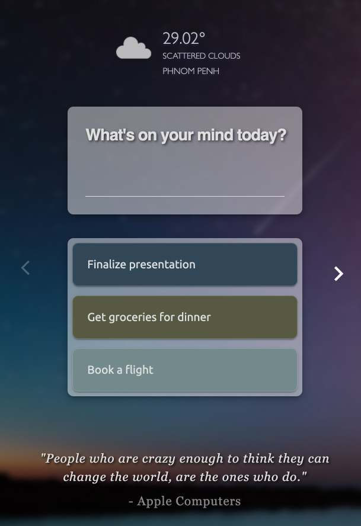

# INSPO 
### A simple to-do list application with current weather info, a daily quote, and inspirational background images.

|||
|:-:|:-:|

## Features
- Check the current weather
- Show inspirational images
- Cycle through multiple fetched images
- Show an inspirational quote daily
- Write down goals
- Delete goals
- Mark goals as complete
- Mark completed goals as a new goal
- After mark a goal as completed, a confetti animation appears

## Technologies used
- HTML
- CSS
- JavaScript
   - Weather data fetch from [OpenWeather](https://openweathermap.org/) API
   - Quote fetch from [They Said So](https://theysaidso.com/) API
   - Images fetch from [Unsplash](https://unsplash.com/) API
- React
- Redux
- Git and GitHub

---

This project was bootstrapped with [Create React App](https://github.com/facebook/create-react-app), using the [Redux](https://redux.js.org/) and [Redux Toolkit](https://redux-toolkit.js.org/) template.
